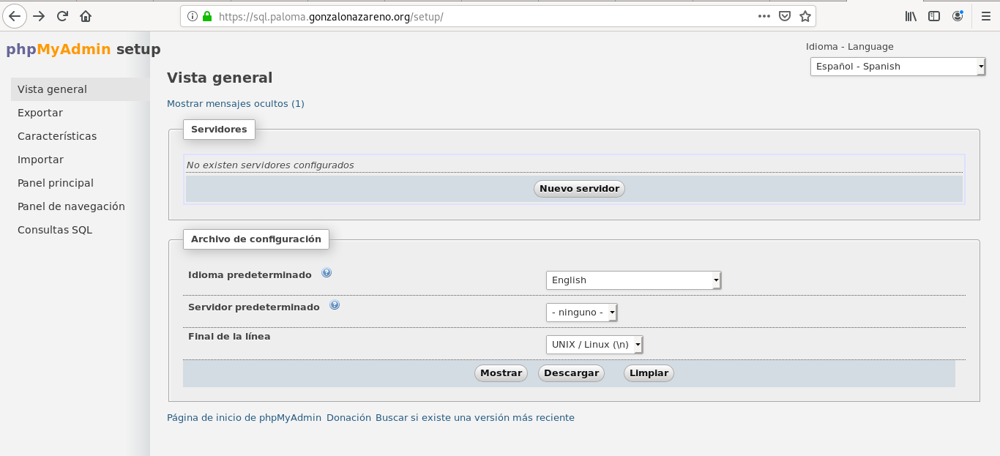
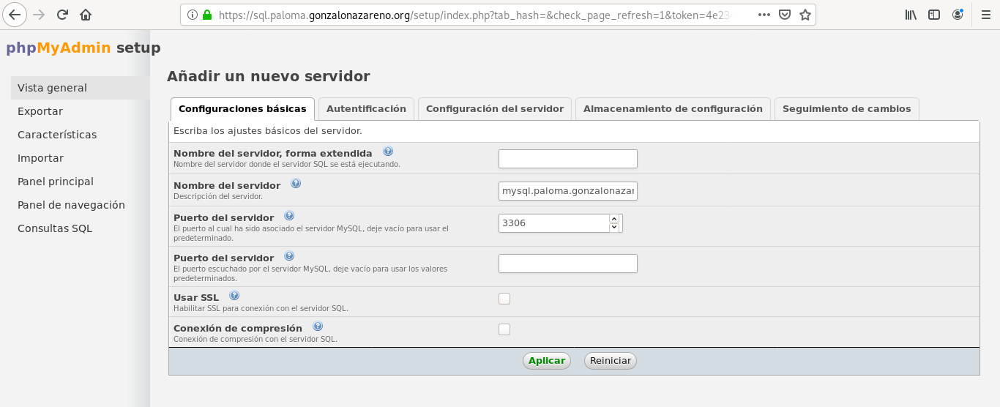
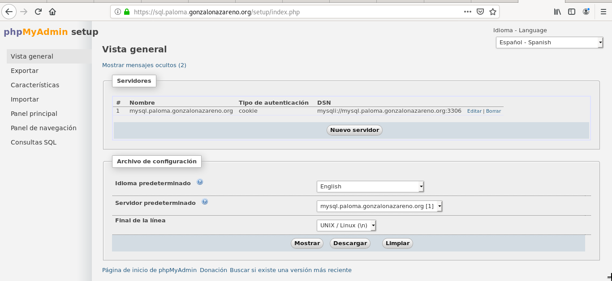
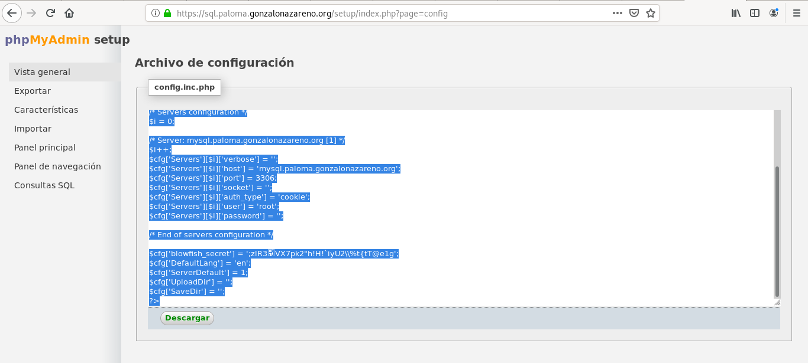
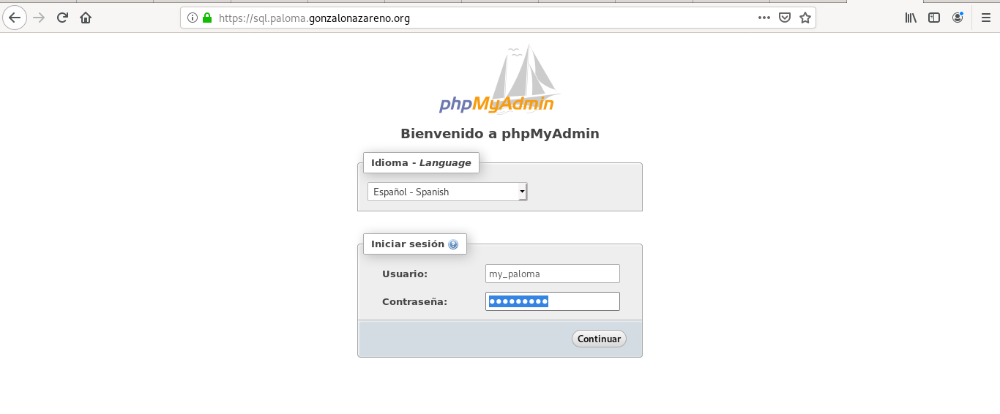
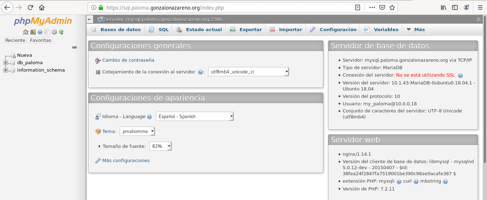

# Creación de un hosting
Queremos que diferentes usuarios, puedan gestionar una página web en vuestro servidor que esté gestionada por medio de un FTP. También se creará una base de datos para cada usuario.

> Por ejemplo, el usuario josedom quiere hacer una página cuyo nombre será servicios:
- La página que vamos a crear será accesible en https://servicios.tunombre.gonzalonazareno.org.
- Se creará un usuario user_josedom, que tendrá una contraseña, para que accediendo a ftp.tunombre.gonzalonazareno.org, pueda gestionar los ficheros de su página web.
- Se creará un usuario en la base de datos llamado myjosedom. Este usuario tendrá una contraseña distinta a la del usuario del servidor FTP.
- Se creará una bases de datos para el usuario anteriormente creado. Para que los usuarios gestionen su base de datos se puede instalar la aplicación phpmyadmin a la que se accederá con la URL https://sql.tunombre.gonzalonmazareno.org.

Tarea: Configura manualmente los distintos servicios para crear un nuevo usuario que gestione su propia página web y tenga una base de datos a su disposición. Instala un CMS.
Mejora 1: Modifica la configuración del sistema para que se usen usuarios virtuales para el acceso por FTP, cuya información este guardada en vuestro directorio ldap.
Mejora 2: Realiza un script que automatice la creación/borrado de nuevos usuarios en el hosting.

### Instalación de proftpd
Se instalará en una máquina centos8.
Se actualiza centos:
~~~
[centos@salmorejo-3 ~]$ sudo dnf update
~~~

Se instala el repositorio epel:
~~~
[centos@salmorejo-3 ~]$ cd /tmp
[centos@salmorejo-3 tmp]$ wget https://dl.fedoraproject.org/pub/epel/epel-release-latest-7.noarch.rpm
[centos@salmorejo-3 tmp]$ sudo dnf install epel-release-latest-7.noarch.rpm 
~~~

Se descarga el paquete:
~~~

[centos@salmorejo-3 tmp]$ wget http://mirror.centos.org/centos/7/os/x86_64/Packages/GeoIP-1.5.0-14.el7.x86_64.rpm
[centos@salmorejo-3 tmp]$ ls
[centos@salmorejo-3 tmp]$ sudo dnf install GeoIP-1.5.0-14.el7.x86_64.rpm
~~~

Se descarga la librería:
~~~
[centos@salmorejo-3 tmp]$ wget http://mirror.centos.org/centos/7/os/x86_64/Packages/tcp_wrappers-libs-7.6-77.el7.x86_64.rpm
[centos@salmorejo-3 tmp]$ sudo dnf install tcp_wrappers-libs-7.6-77.el7.x86_64.rpm 
~~~

Por último se instala proftpd:
~~~
[centos@salmorejo-3 tmp]$ sudo dnf install proftpd
~~~

Una vez instalado ya se puede iniciar el servicio proftpd:
~~~
[centos@salmorejo-3 tmp]$ sudo systemctl start proftpd
[centos@salmorejo-3 tmp]$ sudo systemctl enable proftpd
~~~

### Configuración de proftpd en Centos8
Se habilita el puerto de FTP en el cortafuegos:
~~~
[centos@salmorejo-3 tmp]$ sudo firewall-cmd --add-service=ftp --permanent --zone=public
[centos@salmorejo-3 tmp]$ sudo firewall-cmd --reload
~~~

### Creación de usuario del sistema
Se crea un usuario de Centos para que use más tarde FTP:
~~~
[centos@salmorejo-3 tmp]$ sudo useradd user_paloma
~~~

Se añade una contraseña:
~~~
[centos@salmorejo-3 tmp]$ sudo passwd user_paloma
~~~

### Creación de un virtual host
Se va a crear un sitio web con la dirección: https://space.paloma.gonzalonazareno.org.

Se crea el fichero /etc/nginx/conf.d/user_palomaspace.conf para la configuración de nginx:
~~~
server {
    listen	 80;
    server_name  space.paloma.gonzalonazareno.org;
    rewrite ^ https://$server_name$request_uri permanent;
}

server {
    listen 443 ssl;
    server_name  space.paloma.gonzalonazareno.org;
    ssl on;
    ssl_certificate /etc/pki/tls/certs/paloma.gonzalonazareno.org.crt;
    ssl_certificate_key /etc/pki/tls/private/gonzalonazareno.pem;

    # note that these lines are originally from the "location /" block
    root   /usr/share/nginx/html/user_paloma;
    index index.php index.html index.htm;

    location / {
        try_files $uri $uri/ /index.php?$args;
    }

    location ~ \.php$ {
        try_files $uri =404;
        fastcgi_pass unix:/var/run/php-fpm/www.sock;
        fastcgi_index index.php;
        fastcgi_param SCRIPT_FILENAME $document_root$fastcgi_script_name;
        include fastcgi_params;
    }
}
~~~

A continuación se crea un directorio para el usuario en la ruta indicada en el documentRoot con un .html de prueba:
~~~
[centos@salmorejo-3 tmp]$ cd /usr/share/nginx/html/
[centos@salmorejo-3 html]$ sudo mkdir user_paloma
[centos@salmorejo-3 html]$ sudo touch user_paloma/index.html
[centos@salmorejo-3 html]$ sudo chown -R nginx:nginx user_paloma/ 
~~~

### Configuración de ftp
Se configura el fichero /etc/proftpd.conf:
~~~
DefaultRoot                     /usr/share/nginx/html/%u
~~~

Y se inicia el sistema proftpd:
~~~
[centos@salmorejo-3 html]$ sudo systemctl start proftpd
~~~

Para ver su correcto funcionamiento se añaden las siguientes líneas a /etc/nginx/conf.d/user_palomaspace.conf para que el servidor web permita listar los documentos:
~~~
    location / {
        try_files $uri $uri/ /index.php?$args;
        autoindex on;
        disable_symlinks if_not_owner;
    }
~~~

#### Configuración de SeLinux
~~~
[centos@salmorejo-3 html]$ sudo setsebool -P allow_ftpd_full_access=1
~~~

Y se reinicia el servicio de proftpd:
~~~
[centos@salmorejo-3 html]$ sudo systemctl restart proftpd.service
~~~

##### Comprobación en local
> Para hacer las comprobaciones hay que instalar el paquete ftp.
~~~
[centos@salmorejo-3 html]$ ftp localhost
Connected to localhost (::1).
220 FTP Server ready.
Name (localhost:centos): user_paloma
331 Password required for user_paloma
Password:
230 User user_paloma logged in
Remote system type is UNIX.
Using binary mode to transfer files.
ftp> ls
229 Entering Extended Passive Mode (|||32729|)
150 Opening ASCII mode data connection for file list
-rw-r--r--   1 user_paloma user_paloma        0 Dec 11 11:53 ficheroprueba.txt
226 Transfer complete
ftp> exit
221 Goodbye.
~~~

#### Comprobación en remoto
~~~
paloma@coatlicue:~/DISCO2/CICLO II/Maquinas-claud/Hosting$ ftp ftp.paloma.gonzalonazareno.org
Connected to salmorejo.paloma.gonzalonazareno.org.
220 FTP Server ready.
Name (ftp.paloma.gonzalonazareno.org:paloma): user_paloma
331 Password required for user_paloma
Password:
230 User user_paloma logged in
Remote system type is UNIX.
Using binary mode to transfer files.
ftp> ls
200 PORT command successful
150 Opening ASCII mode data connection for file list
-rw-r--r--   1 user_paloma user_paloma        0 Dec 11 11:53 ficheroprueba.txt
226 Transfer complete
ftp> put pruebaEnCoatlicue.txt 
local: pruebaEnCoatlicue.txt remote: pruebaEnCoatlicue.txt
200 PORT command successful
150 Opening BINARY mode data connection for pruebaEnCoatlicue.txt
226 Transfer complete
ftp> ls
200 PORT command successful
150 Opening ASCII mode data connection for file list
-rw-r--r--   1 user_paloma user_paloma        0 Dec 11 11:53 ficheroprueba.txt
-rw-r--r--   1 user_paloma user_paloma        0 Dec 16 11:10 pruebaEnCoatlicue.txt
226 Transfer complete
ftp> exit
221 Goodbye.
~~~

### Base de datos
#### Creación del usuario de la base de datos
Desde la máquina servidora de la base de datos:
~~~
[centos@salmorejo ~]$ ssh ubuntu@tortilla 'sudo mysql -e "CREATE USER \"my_paloma\"@\"%\" IDENTIFIED BY \"my_paloma\";"'
[centos@salmorejo ~]$ ssh ubuntu@tortilla 'sudo mysql -e "create database db_paloma"'
[centos@salmorejo ~]$ ssh ubuntu@tortilla 'sudo mysql -e "GRANT ALL PRIVILEGES ON db_paloma.* TO \"my_paloma\"@\"%\";"'
~~~

#### phpmyadmin
Instalar y descomprimir myphpadmin:
~~~
[centos@salmorejo ~]$ wget https://files.phpmyadmin.net/phpMyAdmin/4.9.2/phpMyAdmin-4.9.2-all-languages.zip
[centos@salmorejo ~]$ unzip phpMyAdmin-4.9.2-all-languages.zip 
Archive:  phpMyAdmin-4.9.2-all-languages.zip
~~~

Mover los ficheros:
~~~
[centos@salmorejo ~]$ sudo mv phpMyAdmin-4.9.2-all-languages /usr/share/phpmyadmin
~~~

Se cambia el propietario y los permisos del nuevo directorio:
~~~
[centos@salmorejo ~]$ sudo chown nginx:nginx -R /usr/share/nginx/html/phpmyadmin/
[centos@salmorejo ~]$ sudo find /usr/share/nginx/html/phpmyadmin/ -type f -exec chmod 0644 {} \;
[centos@salmorejo ~]$ sudo find /usr/share/nginx/html/phpmyadmin/ -type d -exec chmod 0755 {} \;
[centos@salmorejo ~]$ sudo chcon -t httpd_sys_content_t /usr/share/nginx/html/phpmyadmin -R
[centos@salmorejo ~]$ sudo chcon -t httpd_sys_content_t /usr/share/nginx/html/phpmyadmin/ -R
[centos@salmorejo ~]$ sudo setsebool -P httpd_can_network_connect_db 1
~~~

Se crea el virtualhost de phpmyadmin:
~~~
server {
    listen 80;
    server_name  sql.paloma.gonzalonazareno.org;
    rewrite ^ https://$server_name$request_uri permanent;
}

server {
    listen 443 ssl;
    server_name  sql.paloma.gonzalonazareno.org;
    ssl on;
    ssl_certificate /etc/pki/tls/certs/paloma.gonzalonazareno.org.crt;
    ssl_certificate_key /etc/pki/tls/private/gonzalonazareno.pem;

    root   /usr/share/nginx/html/phpmyadmin;
    index index.php index.html index.htm;

    location / {
        try_files $uri $uri/ /index.php?$args;
    }

    location ~ \.php$ {
        try_files $uri =404;
        fastcgi_pass unix:/var/run/php-fpm/www.sock;
        fastcgi_index index.php;
        fastcgi_param SCRIPT_FILENAME $document_root$fastcgi_script_name;
        include fastcgi_params;
    }
}
~~~

Se reinicia nginx:
~~~
[centos@salmorejo html]$ sudo systemctl restart nginx
[centos@salmorejo html]$ sudo systemctl restart php-fpm
~~~

A partir de aquí se configura la aplicación phpMyAdmin, a través del navegador, para realizar la conexión a nuestra base de datos que se aloja en el servidor tortilla. Se selecciona nuevo servidor:

La siguiente pantalla es para la configuración donde se indica la dirección del servidor de MariaDB:

Tras aplicar los cambios, aparece en la siguiente pantalla el servidor.

Se pulsa el botón mostrar que redirige a una nueva pantalla con un script que se copiará en el fichero /usr/share/nginx/html/phpmyadmin/config.inc.php:

Una vez copiado, ya se puede entrar en la aplicación a través del usuario y la contraseña creados anteriormente en la base de datos.

